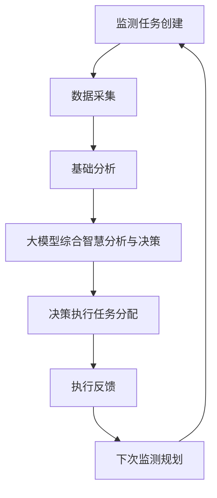
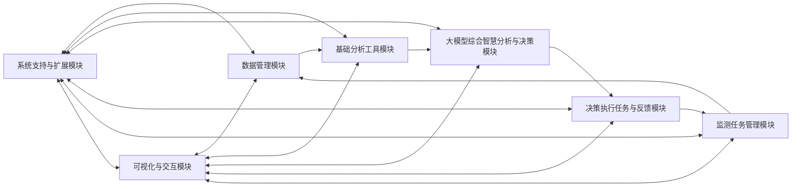
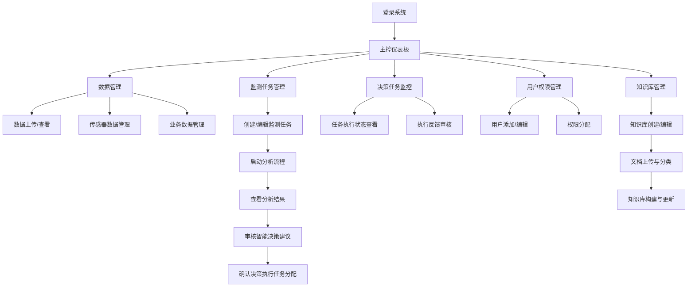
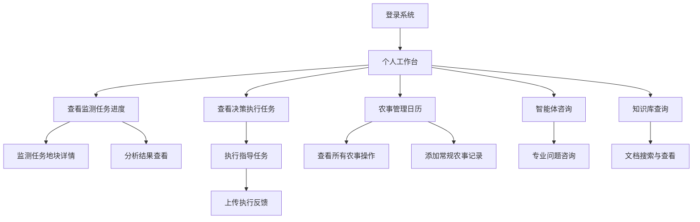
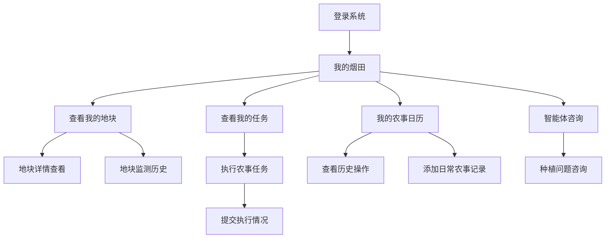

好的，我来详细设计流程和交互部分：

### 一、核心业务流程

#### 1. 监测任务生命周期


1. **监测任务创建**
   - 触发方式：
    - 系统基于上次监测结果和反馈自动规划（需管理员确认）
    - 系统根据烟叶生长周期自动建议（移栽期、旺长期、打顶期、成熟采收期）
    - 管理员手动创建
   - 创建内容：
     - 任务基本信息（编号、名称、类型等）
     - 监测地块选择（可批量选择多个地块）
     - 监测项目配置（烟株计数/长势分析/估产分析）
     - 时间安排（计划开始和结束时间）

2. **数据采集阶段**
   - 无人机影像采集与上传
     - 影像质量检查（清晰度、覆盖范围）
     - 自动匹配地块信息（基于烟田地块边界矢量数据）
   - 气象数据自动获取（http://www.envicloud.cn/pages/guide.html#v2weatherlive）
     - 实时气象数据（调用第三方API、温湿度、降水量、光照）
     - 天气预报数据（调用第三方API）
   - 种植参数确认
     - 合同面积
     - 留叶数范围
     - 单叶干重范围

3. **基础分析阶段**
   - 分析任务编排：
```python
     # 任务编排示例
    class AnalysisPipeline:
        def __init__(self, task_id):
            self.task_id = task_id
            self.field_data = self.get_field_data()
            
        async def execute(self):
            # 烟株计数分析
            plant_count_result = await self.run_plant_count(
                images=self.field_data.drone_images,
                field_boundaries=self.field_data.field_boundaries,
                task_id=self.task_id
            )
            
            # 长势分析
            growth_result = await self.run_growth_analysis(
                images=self.field_data.drone_images,
                field_boundaries=self.field_data.field_boundaries,
                task_id=self.task_id
            )
            
            # 估产分析
            if plant_count_result and growth_result:
                yield_result = await self.run_yield_estimation(
                    plant_count=plant_count_result,
                    growth_analysis=growth_result,
                    contract_area=self.field_data.contract_area,
                    leaf_retention=self.field_data.leaf_retention,
                    single_leaf_weight=self.field_data.single_leaf_weight,
                    field_boundaries=self.field_data.field_boundaries,
                    task_id=self.task_id
                )
```

4. **大模型综合智慧分析与决策阶段**
   - 分析流程：
```python
    class LLMAnalysisPipeline:
        def __init__(self, task_id, field_id):
            self.task_id = task_id
            self.field_id = field_id
            self.analysis_results = self.get_analysis_results()
            self.historical_data = self.get_historical_data()
            self.knowledge_base = self.get_knowledge_base()
            
        async def execute(self):
            # 参数优化（优化基础分析中的参数）
            optimized_params = await self.run_parameter_optimization(
                historical_data=self.historical_data,
                current_data=self.analysis_results,
                knowledge_base=self.knowledge_base
            )
            
            # 异常诊断（识别生长异常并分析原因）
            diagnosis = await self.run_anomaly_diagnosis(
                analysis_results=self.analysis_results,
                historical_data=self.historical_data,
                optimized_params=optimized_params,
                knowledge_base=self.knowledge_base,
                weather_data=self.get_weather_data()
            )
            
            # 策略推演（制定种植决策建议）
            if diagnosis:
                strategy = await self.run_strategy_planning(
                    diagnosis=diagnosis,
                    historical_tasks=self.historical_data.previous_tasks,
                    weather_forecast=self.get_weather_forecast(),
                    knowledge_base=self.knowledge_base,
                    growing_phase=self.get_growing_phase()
                )
            
            # 报告生成（生成综合分析报告）
            if strategy:
                report = await self.generate_report(
                    diagnosis=diagnosis,
                    strategy=strategy,
                    analysis_results=self.analysis_results,
                    field_info=self.get_field_info()
                )
                
            # 监测任务制定（规划下次监测）
            next_monitoring = await self.plan_next_monitoring(
                current_results=self.analysis_results,
                strategy=strategy,
                feedback=self.get_previous_feedback(),
                growing_phase=self.get_growing_phase(),
                weather_forecast=self.get_weather_forecast()
            )

            # 智能体交互支持（提供对话能力）
            await self.enable_chat_support(
                analysis_results=self.analysis_results,
                knowledge_base=self.knowledge_base
            )
```

5. **决策执行任务分配阶段**
   - 任务分发流程：
```python
    class TaskDispatcher:
        def dispatch_tasks(self, strategy_recommendations):
            execution_tasks = []
            
            for strategy in strategy_recommendations:
                # 根据地块信息确定关联烟农和烟技人员
                field_info = self.get_field_info(strategy.field_id)
                
                # 创建执行任务
                task = self.create_execution_task(
                    strategy=strategy,
                    field_info=field_info,
                    priority=self.calculate_priority(strategy)
                )
                
                # 分配任务给烟农和烟技人员
                farmers = field_info.farmers
                technicians = field_info.technicians
                
                self.assign_task(task, farmers, technicians)
                
                # 发送通知（Web端）
                self.send_notifications(task)
                
                # 添加到农事日历
                self.add_to_calendar(task, is_decision_task=True)
                
                execution_tasks.append(task)
                
            return execution_tasks
```

6. **执行反馈阶段**
   - 反馈收集：
     - 执行时间记录
     - 执行照片上传
     - 执行效果评估（完成度、质量）
     - 困难和建议记录
   - 反馈分析：
     - 执行效果评估（与预期对比）
     - 问题归类统计
     - 经验总结提取（用于知识库更新）

7. **下次监测规划**
   - 规划依据：
     - 本次执行效果与反馈
     - 作物生长周期阶段
     - 天气预报信息
     - 历史监测经验
   - 规划内容：
     - 下次监测时间
     - 监测项目选择
     - 重点关注区域和内容

#### 2. 模块间数据流转



1. **数据流转规范**
```python
class DataTransfer:
    def __init__(self):
        self.data_format = {
            'metadata': {
                'task_id': str,          # 任务ID
                'field_id': str,          # 地块ID
                'timestamp': datetime,    # 时间戳
                'version': str,           # 数据版本
                'growing_phase': str,     # 生长周期阶段
                'data_source': str,       # 数据来源
                'data_type': str          # 数据类型
            },
            'data': dict,                 # 实际数据
            'status': str,                # 处理状态
            'error': str,                 # 错误信息
            'quality_check': {            # 数据质量检查
                'is_valid': bool,
                'quality_score': float,
                'issues': list
            }
        }
    
    def validate_data(self, data):
        """数据格式验证"""
        pass
    
    def transform_data(self, data, target_module):
        """数据格式转换"""
        pass
    
    def track_data_flow(self, data, source, target):
        """数据流转追踪"""
        pass
```

2. **模块依赖关系**
```python
class ModuleDependency:
    def __init__(self):
        self.dependencies = {
            'basic_analysis': ['data_management'],
            'llm_analysis': ['basic_analysis', 'data_management'],
            'execution': ['llm_analysis'],
            'feedback': ['execution'],
            'planning': ['feedback', 'data_management']
        }
    
    def check_dependencies(self, module):
        """检查模块依赖是否满足"""
        pass
    
    def get_dependent_data(self, module):
        """获取依赖数据"""
        pass
```

### 二、交互设计

#### 1. 用户交互流程

1. **管理员视角**


2. **烟技人员视角**


3. **烟农视角**


#### 2. 系统响应机制

1. **实时通知**
```python
class NotificationService:
    def __init__(self):
        self.notification_types = {
            'task_created': '新监测任务通知',
            'analysis_completed': '分析完成通知',
            'decision_task_assigned': '决策执行任务分配通知',
            'task_reminder': '任务执行提醒',
            'execution_feedback': '执行反馈通知',
            'weather_alert': '天气预警通知',
            'growth_anomaly': '生长异常警报',
            'next_monitoring_suggested': '下次监测建议通知',
            'knowledge_base_updated': '知识库更新通知',
            'parameter_optimization': '参数优化通知',
            'growing_phase_change': '生长周期变更通知'
        }
        
    async def send_notification(self, user_id, type, content, priority='normal'):
        # 根据用户角色和通知类型选择通知方式
        user_preferences = self.get_user_preferences(user_id)
        notification_methods = self.determine_methods(type, priority, user_preferences)
        
        # 智能体对话窗口通知
        if self.should_use_chat_window(type, priority):
            await self.send_chat_notification(user_id, content)
            
        # Web端通知发送
        for method in notification_methods:
            await self.dispatch_notification(user_id, type, content, method)
    
    def get_user_notifications(self, user_id):
        """获取用户通知历史"""
        pass
```

2. **状态追踪**
```python
class StatusTracker:
    def __init__(self):
        self.status_flow = {
            'monitoring_task': [
                'created',               # 已创建
                'data_collecting',       # 数据采集中
                'data_validating',       # 数据验证中
                'basic_analyzing',       # 基础分析中
                'llm_analyzing',         # 大模型分析中
                'decision_making',       # 决策制定中
                'executing',             # 执行中
                'feedback_collecting',   # 反馈收集中
                'completed',             # 已完成
                'planning_next'          # 规划下次监测
            ],
            'execution_task': [
                'created',               # 已创建
                'assigned',              # 已分配
                'notified',              # 已通知
                'in_progress',           # 进行中
                'feedback_submitted',    # 已提交反馈
                'feedback_validated',    # 反馈已验证
                'verified',              # 已验证
                'completed'              # 已完成
            ],
            'analysis_job': [
                'queued',                # 队列中
                'data_preparing',        # 数据准备中
                'processing',            # 处理中
                'quality_checking',      # 质量检查中
                'completed',             # 已完成
                'failed'                 # 失败
            ],
            'knowledge_base': [          # 知识库状态
                'creating',              # 创建中
                'updating',              # 更新中
                'active',                # 活跃
                'inactive'               # 非活跃
            ]
        }
        
    def update_status(self, task_id, task_type, new_status):
        # 验证状态转换是否合法
        if self.validate_status_transition(task_id, task_type, new_status):
            return self.set_status(task_id, task_type, new_status)
        return False
    
    def get_task_progress(self, task_id):
        """获取任务进度百分比"""
        pass
```

3. **错误处理**
```python
class ErrorHandler:
    def __init__(self):
        self.error_levels = {
            'critical': '需要立即人工干预',
            'warning': '可能影响系统运行',
            'info': '提示性信息'
        }
    
    def handle_error(self, error, context):
        """处理错误并记录日志"""
        error_level = self.determine_error_level(error)
        self.log_error(error, context, error_level)
        
        if error_level == 'critical':
            self.notify_admin(error, context)
        
        return self.get_error_solution(error)
    
    def notify_admin(self, error, context):
        """通知管理员处理严重错误"""
        pass
        
    def determine_error_level(self, error):
        """确定错误级别"""
        pass
```

