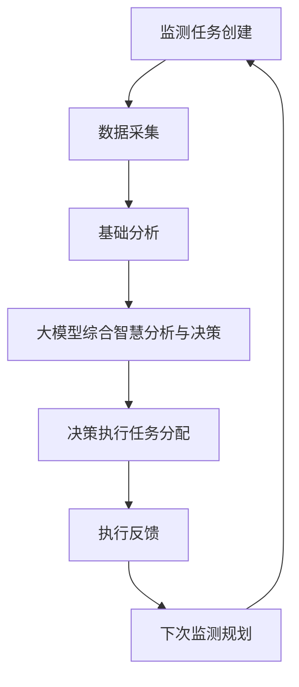
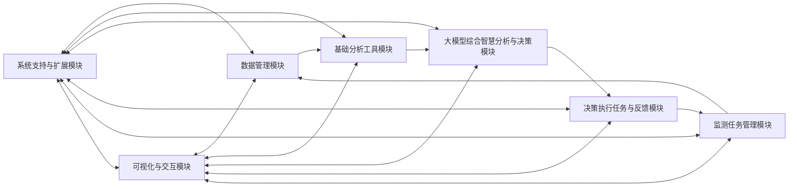
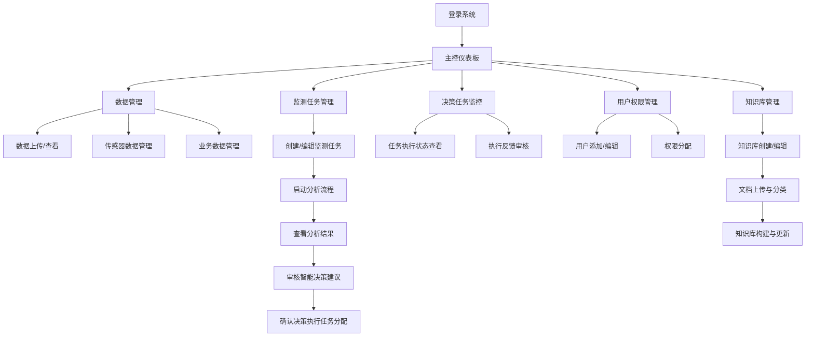
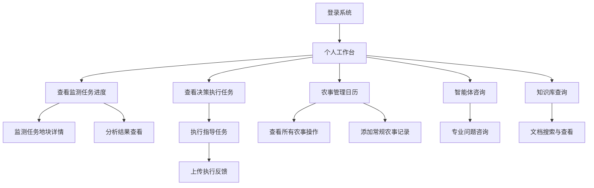
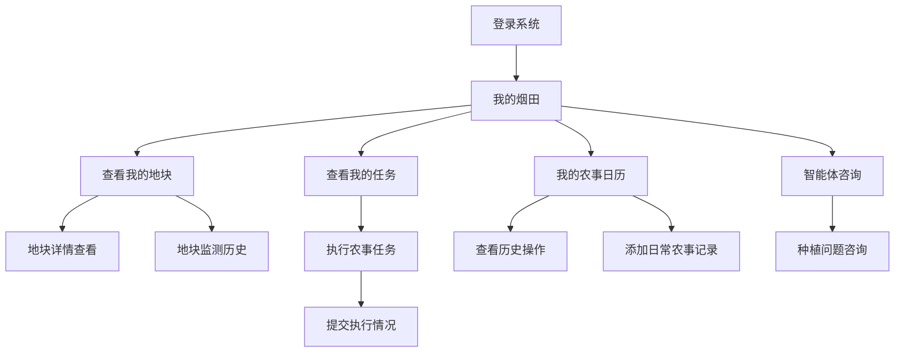

# 智慧烟田系统设计方案

## 一、技术选型

### 后端技术
- **Django 5 + DRF**：构建RESTful API和管理数据库
- **Celery**：处理异步任务和定时任务
- **PostgreSQL + PostGIS**：支持地理空间数据的关系型数据库
- **Redis**：缓存、消息队列和Celery结果存储

### 前端技术
- **Vue 3 + Pinia**：状态管理和组件化开发
- **Element Plus**：UI组件库
- **Leaflet**：地图可视化
- **ECharts**：数据图表展示

### 集成服务
- **大模型API**：使用Dify/COZE API构建知识库和智能决策支持
- **天气API**：获取实时天气和预报数据

### 部署架构
- **后端**：Nginx + Gunicorn + Django
- **前端**：Nginx + Vue静态资源
- **文件存储**：对象存储服务

## 二、流程与交互

### 1. 监测任务生命周期



#### 1.1 监测任务创建
- **触发方式**
  - 系统基于上次监测结果和反馈自动规划（管理员确认）
  - 系统根据烟叶生长周期自动建议
  - 管理员手动创建
- **创建内容**
  - 任务基本信息（编号、名称、类型等）
  - 监测地块选择（支持批量）
  - 监测项目配置（烟株计数/长势分析/估产分析）
  - 时间安排（计划开始和结束时间）

#### 1.2 数据采集阶段
- **无人机影像**
  - 手动上传
  - 自动影像质量检查
  - 自动匹配地块信息
- **气象数据**
  - 实时气象数据API调用
  - 天气预报数据API调用
- **种植参数确认**
  - 合同面积
  - 留叶数范围
  - 单叶干重范围

#### 1.3 基础分析阶段
- **分析任务编排**
  - 烟株计数分析
  - 长势分析
  - 估产分析

#### 1.4 大模型综合智慧分析与决策阶段
- **分析流程**
  - 参数优化
  - 异常诊断
  - 策略推演
  - 报告生成
  - 监测任务制定
  - 智能体交互支持

#### 1.5 决策执行任务分配阶段
- **任务分发流程**
  - 根据地块信息确定关联烟农和烟技人员
  - 创建执行任务
  - 发送通知
  - 添加到农事日历

#### 1.6 执行反馈阶段
- **反馈收集**
  - 执行时间记录
  - 执行照片上传
  - 执行效果评估
  - 困难和建议记录
- **反馈分析**
  - 执行效果评估
  - 问题归类统计
  - 经验总结提取

#### 1.7 下次监测规划
- **规划依据**
  - 本次执行效果与反馈
  - 作物生长周期阶段
  - 天气预报信息
  - 历史监测经验
- **规划内容**
  - 下次监测时间
  - 监测项目选择
  - 重点关注区域和内容

### 2. 模块间数据流转



### 3. 用户交互流程

#### 3.1 管理员视角


#### 3.2 烟技人员视角


#### 3.3 烟农视角


### 4. 系统响应机制

#### 4.1 实时通知
- 任务创建通知
- 分析完成通知
- 决策执行任务分配通知
- 任务执行提醒
- 执行反馈通知
- 天气预警通知
- 生长异常警报
- 下次监测建议通知

#### 4.2 状态追踪
- 监测任务状态流转
- 执行任务状态流转
- 分析作业状态流转
- 知识库状态流转

#### 4.3 错误处理
- 错误级别划分
- 错误日志记录
- 管理员紧急通知

## 三、项目结构

### 后端结构
```
smart_tobacco/
│
├── apps/                       # Django 应用目录
│   ├── config/                 # 系统配置模块
│   ├── accounts/               # 用户认证与权限
│   ├── fields/                 # 烟田地块管理
│   ├── data_management/        # 数据管理(影像、气象等)
│   ├── monitoring/             # 监测任务管理
│   ├── analysis/               # 基础分析工具
│   ├── llm_analysis/           # 大模型分析与决策
│   │   ├── providers/          # 大模型服务提供商
│   │   ├── prompts/            # 提示词模板
│   │   └── pipelines/          # 分析流水线
│   ├── execution/              # 决策执行与反馈
│   └── farming/                # 农事管理
│
├── core/                       # 核心功能模块
│   ├── settings/               # 项目设置
│   ├── urls.py                 # 主URL配置
│   ├── middleware.py           # 自定义中间件
│   └── celery.py               # Celery配置
│
├── utils/                      # 工具函数
│   ├── validators.py           # 验证器
│   ├── geo_utils.py            # 地理信息工具
│   ├── file_handlers.py        # 文件处理工具
│   └── api_clients/            # 外部API客户端
│
├── third_party/                # 第三方服务集成
│   ├── dify_client.py          # Dify API集成
│   └── weather_api.py          # 气象数据API
│
├── templates/                  # Django模板
│
├── static/                     # 静态文件
│
├── media/                      # 用户上传文件
│   ├── drone_images/           # 无人机影像
│   │   ├── {year}/             # 年份
│   │   │   ├── {month}/        # 月份
│   │   │   │   ├── raw/        # 原始影像
│   │   │   │   └── processed/  # 处理后影像
│   ├── documents/              # 文档
│   │   ├── technical/          # 技术文档
│   │   ├── policy/             # 政策文档
│   │   └── reports/            # 分析报告
│   └── feedback/               # 执行反馈
│       ├── {year}/          
│       │   ├── {month}/     
│       │   │   ├── images/     # 图片
│       │   │   └── videos/     # 视频
│
└── requirements/               # 依赖管理
    ├── base.txt                # 基础依赖
    ├── dev.txt                 # 开发环境依赖
    └── prod.txt                # 生产环境依赖
```

### 前端结构
```
smart_tobacco_frontend/
│
├── public/                    # 静态资源目录
│
├── src/
│   ├── constants/             # 常量定义
│   │   ├── api.js             # API路径常量
│   │   ├── enums.js           # 枚举值定义
│   │   └── config.js          # 配置常量
│   ├── composables/           # 组合式函数
│   │   ├── useAuth.js         # 认证相关
│   │   ├── useMap.js          # 地图相关
│   │   └── useAnalysis.js     # 分析相关
│   ├── api/                   # API请求模块
│   │   ├── auth.js            # 认证API
│   │   ├── fields.js          # 地块API
│   │   ├── monitoring.js      # 监测任务API
│   │   ├── analysis.js        # 分析API
│   │   ├── llm.js             # 大模型API
│   │   ├── execution.js       # 执行任务API
│   │   └── farming.js         # 农事API
│   ├── assets/                # 静态资源
│   ├── components/            # 通用组件
│   │   ├── common/            # 公共组件
│   │   ├── map/               # 地图组件
│   │   ├── analysis/          # 分析组件
│   │   ├── monitoring/        # 监测任务组件
│   │   └── execution/         # 执行任务组件
│   ├── layouts/               # 布局组件
│   │   ├── AdminLayout.vue    # 管理员布局
│   │   ├── TechnicianLayout.vue # 烟技人员布局
│   │   └── FarmerLayout.vue   # 烟农布局
│   ├── router/                # 路由配置
│   ├── store/                 # Pinia状态管理
│   │   ├── auth.js            # 认证状态
│   │   ├── fields.js          # 地块状态
│   │   ├── monitoring.js      # 监测任务状态
│   │   └── execution.js       # 执行任务状态
│   ├── views/                 # 页面组件
│   │   ├── auth/              # 认证页面
│   │   ├── dashboard/         # 仪表盘
│   │   ├── fields/            # 地块管理
│   │   ├── monitoring/        # 监测任务
│   │   ├── analysis/          # 数据分析
│   │   ├── llm/               # 大模型决策
│   │   ├── execution/         # 执行反馈
│   │   └── farming/           # 农事管理
│   │
│   ├── utils/                 # 工具函数
│   │   ├── auth.js            # 认证相关
│   │   ├── date.js            # 日期处理
│   │   ├── geojson.js         # GeoJSON处理
│   │   └── validators.js      # 表单验证
│   │
│   ├── App.vue                # 根组件
│   └── main.js                # 入口文件
│
├── .env                       # 环境变量
├── .env.development           # 开发环境变量
├── .env.production            # 生产环境变量
└── vite.config.js             # Vite配置
```

## 四、数据库设计

### 1. 用户与权限模块

#### 用户表(users)
```sql
CREATE TABLE users (
    id SERIAL PRIMARY KEY,
    username VARCHAR(50) UNIQUE NOT NULL,
    password VARCHAR(255) NOT NULL,
    email VARCHAR(100) UNIQUE NOT NULL,
    phone VARCHAR(20),
    role VARCHAR(20) NOT NULL, -- admin, technician, farmer
    created_at TIMESTAMP DEFAULT CURRENT_TIMESTAMP,
    updated_at TIMESTAMP DEFAULT CURRENT_TIMESTAMP,
    last_login TIMESTAMP,
    is_active BOOLEAN DEFAULT TRUE
);
```

#### 地块权限表(field_permissions)
```sql
CREATE TABLE field_permissions (
    id SERIAL PRIMARY KEY,
    user_id INTEGER REFERENCES users(id) ON DELETE CASCADE,
    field_id INTEGER REFERENCES tobacco_fields(id) ON DELETE CASCADE,
    permission_type VARCHAR(20) NOT NULL, -- read, write, manage
    created_at TIMESTAMP DEFAULT CURRENT_TIMESTAMP,
    UNIQUE(user_id, field_id)
);
```

### 2. 烟田基础数据模块

#### 烟田地块表(tobacco_fields)
```sql
CREATE TABLE tobacco_fields (
    id SERIAL PRIMARY KEY,
    field_code VARCHAR(50) UNIQUE NOT NULL,
    field_name VARCHAR(100) NOT NULL,
    contract_area FLOAT NOT NULL, -- 合同面积(亩)
    actual_area FLOAT, -- 实际面积(亩)
    location GEOGRAPHY(POLYGON), -- PostGIS地理数据类型
    boundary JSONB, -- GeoJSON格式边界数据
    farmer_id INTEGER REFERENCES users(id),
    technician_id INTEGER REFERENCES users(id),
    created_at TIMESTAMP DEFAULT CURRENT_TIMESTAMP,
    updated_at TIMESTAMP DEFAULT CURRENT_TIMESTAMP
);
```

### 3. 数据管理模块

#### 无人机影像数据表(drone_images)
```sql
CREATE TABLE drone_images (
    id SERIAL PRIMARY KEY,
    file_path VARCHAR(255) NOT NULL,
    file_size INTEGER NOT NULL,
    image_type VARCHAR(50) NOT NULL, -- 多光谱、RGB等
    acquisition_date TIMESTAMP NOT NULL,
    monitoring_task_id INTEGER REFERENCES monitoring_tasks(id),
    coverage_area GEOGRAPHY(POLYGON),
    resolution FLOAT, -- 空间分辨率(cm)
    upload_user_id INTEGER REFERENCES users(id),
    upload_time TIMESTAMP DEFAULT CURRENT_TIMESTAMP,
    metadata JSONB, -- 存储额外元数据
    quality_score FLOAT, -- 影像质量评分
    is_valid BOOLEAN DEFAULT TRUE -- 影像是否有效
);
```

#### 气象数据表(weather_data)
```sql
CREATE TABLE weather_data (
    id SERIAL PRIMARY KEY,
    field_id INTEGER REFERENCES tobacco_fields(id), -- 关联到地块
    location GEOGRAPHY(POINT), -- 数据对应的地理位置
    temperature FLOAT,
    humidity FLOAT,
    rainfall FLOAT,
    wind_speed FLOAT,
    wind_direction VARCHAR(10),
    light_intensity FLOAT,
    record_time TIMESTAMP NOT NULL,
    data_source VARCHAR(50) NOT NULL, -- 改为API来源
    api_request_id VARCHAR(100), -- API请求ID
    created_at TIMESTAMP DEFAULT CURRENT_TIMESTAMP
);
```

#### 烟叶种植参数表(tobacco_parameters)
```sql
CREATE TABLE tobacco_parameters (
    id SERIAL PRIMARY KEY,
    field_id INTEGER REFERENCES tobacco_fields(id),
    growing_season INTEGER NOT NULL, -- 种植年度
    leaf_retention_min INTEGER,
    leaf_retention_max INTEGER,
    leaf_weight_min FLOAT, -- 单叶干重最小值(g)
    leaf_weight_max FLOAT, -- 单叶干重最大值(g)
    created_at TIMESTAMP DEFAULT CURRENT_TIMESTAMP,
    updated_at TIMESTAMP DEFAULT CURRENT_TIMESTAMP,
    user_id INTEGER REFERENCES users(id)
);
```

#### 文档管理表(documents)
```sql
CREATE TABLE documents (
    id SERIAL PRIMARY KEY,
    title VARCHAR(255) NOT NULL,
    file_path VARCHAR(255) NOT NULL,
    file_type VARCHAR(50) NOT NULL, -- PDF, DOCX, JPG等
    file_size INTEGER NOT NULL,
    category VARCHAR(50) NOT NULL, -- 技术指南、病虫害防治等
    tags JSONB, -- 标签数组
    description TEXT,
    upload_user_id INTEGER REFERENCES users(id),
    upload_time TIMESTAMP DEFAULT CURRENT_TIMESTAMP,
    version VARCHAR(20) DEFAULT '1.0'
);
```

#### 知识库表(knowledge_bases)
```sql
CREATE TABLE knowledge_bases (
    id SERIAL PRIMARY KEY,
    name VARCHAR(100) NOT NULL,
    description TEXT,
    api_provider VARCHAR(50) NOT NULL, -- dify, coze等
    api_key VARCHAR(255),
    api_endpoint VARCHAR(255),
    status VARCHAR(20) DEFAULT 'active', -- active, creating, updating, inactive
    created_at TIMESTAMP DEFAULT CURRENT_TIMESTAMP,
    created_by INTEGER REFERENCES users(id),
    updated_at TIMESTAMP DEFAULT CURRENT_TIMESTAMP
);
```

#### 知识库文档关联表(knowledge_base_documents)
```sql
CREATE TABLE knowledge_base_documents (
    id SERIAL PRIMARY KEY,
    knowledge_base_id INTEGER REFERENCES knowledge_bases(id) ON DELETE CASCADE,
    document_id INTEGER REFERENCES documents(id) ON DELETE CASCADE,
    added_at TIMESTAMP DEFAULT CURRENT_TIMESTAMP,
    added_by INTEGER REFERENCES users(id),
    UNIQUE(knowledge_base_id, document_id)
);
```

### 4. 监测任务管理模块

#### 监测任务类型配置表(monitoring_task_types)
```sql
CREATE TABLE monitoring_task_types (
    id SERIAL PRIMARY KEY,
    type_code VARCHAR(50) UNIQUE NOT NULL,
    type_name VARCHAR(100) NOT NULL,
    description TEXT,
    required_analysis_types JSONB, -- ['plant_count', 'growth', 'yield']
    created_at TIMESTAMP DEFAULT CURRENT_TIMESTAMP
);
```

#### 监测任务表(monitoring_tasks)
```sql
CREATE TABLE monitoring_tasks (
    id SERIAL PRIMARY KEY,
    task_code VARCHAR(50) UNIQUE NOT NULL,
    task_name VARCHAR(100) NOT NULL,
    task_type VARCHAR(50) NOT NULL, -- 对应monitoring_task_types的type_code
    growing_phase VARCHAR(50), -- 移栽期、旺长期、打顶期、成熟采收期
    scheduled_start_date TIMESTAMP NOT NULL,
    scheduled_end_date TIMESTAMP NOT NULL,
    actual_start_date TIMESTAMP,
    actual_end_date TIMESTAMP,
    status VARCHAR(20) DEFAULT 'created', -- created, data_collecting, data_validating, basic_analyzing, llm_analyzing, decision_making, executing, feedback_collecting, completed, planning_next
    created_by INTEGER REFERENCES users(id),
    created_at TIMESTAMP DEFAULT CURRENT_TIMESTAMP,
    updated_at TIMESTAMP DEFAULT CURRENT_TIMESTAMP,
    description TEXT,
    priority VARCHAR(10) DEFAULT 'medium', -- high, medium, low
    previous_task_id INTEGER REFERENCES monitoring_tasks(id) -- 前一次监测任务
);
```

#### 监测任务地块关联表(monitoring_task_fields)
```sql
CREATE TABLE monitoring_task_fields (
    id SERIAL PRIMARY KEY,
    monitoring_task_id INTEGER REFERENCES monitoring_tasks(id) ON DELETE CASCADE,
    field_id INTEGER REFERENCES tobacco_fields(id) ON DELETE CASCADE,
    status VARCHAR(20) DEFAULT 'pending', -- pending, completed, skipped
    created_at TIMESTAMP DEFAULT CURRENT_TIMESTAMP,
    UNIQUE(monitoring_task_id, field_id)
);
```

### 5. 基础分析结果模块

#### 烟株计数结果表(plant_count_results)
```sql
CREATE TABLE plant_count_results (
    id SERIAL PRIMARY KEY,
    monitoring_task_id INTEGER REFERENCES monitoring_tasks(id),
    field_id INTEGER REFERENCES tobacco_fields(id),
    plant_count INTEGER NOT NULL,
    plant_density FLOAT NOT NULL, -- 株/亩
    geojson_path VARCHAR(255), -- 存储烟株矢量点文件路径
    created_at TIMESTAMP DEFAULT CURRENT_TIMESTAMP,
    analysis_time FLOAT, -- 分析耗时(秒)
    status VARCHAR(20) DEFAULT 'success', -- success, failed, partial
    error_message TEXT,
    UNIQUE(monitoring_task_id, field_id)
);
```

#### 长势分析结果表(growth_analysis_results)
```sql
CREATE TABLE growth_analysis_results (
    id SERIAL PRIMARY KEY,
    monitoring_task_id INTEGER REFERENCES monitoring_tasks(id),
    field_id INTEGER REFERENCES tobacco_fields(id),
    tif_path VARCHAR(255), -- 长势分级图文件路径
    excellent_area_ratio FLOAT, -- 优等长势面积占比
    good_area_ratio FLOAT, -- 良好长势面积占比
    medium_area_ratio FLOAT, -- 中等长势面积占比
    poor_area_ratio FLOAT, -- 较差长势面积占比
    created_at TIMESTAMP DEFAULT CURRENT_TIMESTAMP,
    analysis_time FLOAT, -- 分析耗时(秒)
    status VARCHAR(20) DEFAULT 'success', -- success, failed, partial
    error_message TEXT,
    UNIQUE(monitoring_task_id, field_id)
);
```

#### 估产分析结果表(yield_estimation_results)
```sql
CREATE TABLE yield_estimation_results (
    id SERIAL PRIMARY KEY,
    monitoring_task_id INTEGER REFERENCES monitoring_tasks(id),
    field_id INTEGER REFERENCES tobacco_fields(id),
    estimated_yield FLOAT NOT NULL, -- 估产(kg)
    yield_per_mu FLOAT NOT NULL, -- 亩产(kg/亩)
    confidence_level FLOAT, -- 置信度
    created_at TIMESTAMP DEFAULT CURRENT_TIMESTAMP,
    analysis_time FLOAT, -- 分析耗时(秒)
    status VARCHAR(20) DEFAULT 'success', -- success, failed, partial
    error_message TEXT,
    UNIQUE(monitoring_task_id, field_id)
);
```

### 6. 大模型分析与决策模块

#### 异常诊断表(anomaly_diagnosis)
```sql
CREATE TABLE anomaly_diagnosis (
    id SERIAL PRIMARY KEY,
    monitoring_task_id INTEGER REFERENCES monitoring_tasks(id),
    field_id INTEGER REFERENCES tobacco_fields(id),
    anomaly_type VARCHAR(50) NOT NULL, -- 病害、虫害、生长异常等
    severity VARCHAR(20) NOT NULL, -- high, medium, low
    affected_area_ratio FLOAT, -- 受影响面积比例
    diagnosis_result TEXT NOT NULL, -- 异常诊断结果
    possible_causes TEXT, -- 可能原因
    created_at TIMESTAMP DEFAULT CURRENT_TIMESTAMP,
    llm_model_used VARCHAR(50), -- 使用的大模型
    api_request_id VARCHAR(100), -- API请求ID，便于追踪
    confidence_score FLOAT -- 诊断置信度
);
```

#### 策略推演表(strategy_recommendations)
```sql
CREATE TABLE strategy_recommendations (
    id SERIAL PRIMARY KEY,
    monitoring_task_id INTEGER REFERENCES monitoring_tasks(id),
    field_id INTEGER REFERENCES tobacco_fields(id),
    recommendation_type VARCHAR(50) NOT NULL, -- 施肥、病虫害防治、灌溉等
    recommendation_content TEXT NOT NULL,
    priority VARCHAR(10) NOT NULL, -- high, medium, low
    execution_deadline TIMESTAMP,
    created_at TIMESTAMP DEFAULT CURRENT_TIMESTAMP,
    llm_model_used VARCHAR(50),
    confidence_score FLOAT,
    previous_execution_feedback TEXT -- 上一次执行情况反馈
);
```

#### 分析报告表(analysis_reports)
```sql
CREATE TABLE analysis_reports (
    id SERIAL PRIMARY KEY,
    monitoring_task_id INTEGER REFERENCES monitoring_tasks(id),
    field_id INTEGER REFERENCES tobacco_fields(id), -- NULL表示整体报告
    report_title VARCHAR(255) NOT NULL,
    report_content TEXT NOT NULL,
    report_format VARCHAR(20) DEFAULT 'html', -- html, pdf, markdown
    created_at TIMESTAMP DEFAULT CURRENT_TIMESTAMP,
    generated_by VARCHAR(50), -- 生成报告的系统组件或模型
    status VARCHAR(20) DEFAULT 'draft', -- draft, published
    published_at TIMESTAMP
);
```

#### 下次监测规划表(next_monitoring_plan)
```sql
CREATE TABLE next_monitoring_plan (
    id SERIAL PRIMARY KEY,
    monitoring_task_id INTEGER REFERENCES monitoring_tasks(id), -- 当前监测任务
    suggested_start_date TIMESTAMP NOT NULL,
    suggested_end_date TIMESTAMP NOT NULL,
    suggested_type VARCHAR(50), -- 建议的监测类型
    suggested_fields JSONB, -- 建议监测的地块ID数组
    focus_areas TEXT, -- 重点关注区域
    reason TEXT, -- 建议理由
    created_at TIMESTAMP DEFAULT CURRENT_TIMESTAMP,
    status VARCHAR(20) DEFAULT 'pending' -- pending, approved, rejected
);
```

#### 智能体对话记录表(chat_history)
```sql
CREATE TABLE chat_history (
    id SERIAL PRIMARY KEY,
    user_id INTEGER REFERENCES users(id),
    session_id VARCHAR(100),
    question TEXT NOT NULL,
    answer TEXT NOT NULL,
    created_at TIMESTAMP DEFAULT CURRENT_TIMESTAMP,
    related_monitoring_task_id INTEGER REFERENCES monitoring_tasks(id),
    related_field_id INTEGER REFERENCES tobacco_fields(id),
    llm_model_used VARCHAR(50)
);
```

### 7. 决策执行与反馈模块

#### 决策执行任务表(execution_tasks)
```sql
CREATE TABLE execution_tasks (
    id SERIAL PRIMARY KEY,
    task_code VARCHAR(50) UNIQUE NOT NULL,
    recommendation_id INTEGER REFERENCES strategy_recommendations(id),
    field_id INTEGER REFERENCES tobacco_fields(id),
    task_type VARCHAR(50) NOT NULL, -- 施肥、病虫害防治、灌溉等
    task_content TEXT NOT NULL,
    assigned_to INTEGER REFERENCES users(id),
    assigned_by INTEGER REFERENCES users(id),
    assigned_at TIMESTAMP DEFAULT CURRENT_TIMESTAMP,
    due_date TIMESTAMP NOT NULL,
    priority VARCHAR(10) DEFAULT 'medium', -- high, medium, low
    status VARCHAR(20) DEFAULT 'created', -- created, assigned, notified, in_progress, feedback_submitted, feedback_validated, verified, completed
    completion_percentage INTEGER DEFAULT 0,
    notification_sent BOOLEAN DEFAULT FALSE
);
```

#### 执行反馈表(execution_feedback)
```sql
CREATE TABLE execution_feedback (
    id SERIAL PRIMARY KEY,
    execution_task_id INTEGER REFERENCES execution_tasks(id),
    feedback_content TEXT NOT NULL,
    completion_date TIMESTAMP,
    actual_operation TEXT, -- 实际执行的操作详情
    effectiveness_rating INTEGER, -- 1-5评分
    difficulties_encountered TEXT,
    submitted_by INTEGER REFERENCES users(id),
    submitted_at TIMESTAMP DEFAULT CURRENT_TIMESTAMP,
    media_urls JSONB, -- 照片、视频等URL数组
    reviewer_id INTEGER REFERENCES users(id),
    review_status VARCHAR(20) DEFAULT 'pending', -- pending, approved, rejected
    review_comments TEXT
);
```

#### 通知表(notifications)
```sql
CREATE TABLE notifications (
    id SERIAL PRIMARY KEY,
    user_id INTEGER REFERENCES users(id),
    notification_type VARCHAR(50) NOT NULL, -- task_created, analysis_completed, decision_task_assigned等
    title VARCHAR(255) NOT NULL,
    content TEXT NOT NULL,
    related_task_id INTEGER, -- 可能是监测任务ID或执行任务ID
    is_read BOOLEAN DEFAULT FALSE,
    created_at TIMESTAMP DEFAULT CURRENT_TIMESTAMP,
    priority VARCHAR(10) DEFAULT 'normal', -- high, normal, low
    expiry_date TIMESTAMP
);
```

### 8. 农事管理记录模块

#### 农事操作类型配置表(farming_operation_types)
```sql
CREATE TABLE farming_operation_types (
    id SERIAL PRIMARY KEY,
    type_code VARCHAR(50) UNIQUE NOT NULL,
    type_name VARCHAR(100) NOT NULL,
    description TEXT,
    season_applicable JSONB, -- ['transplanting', 'growing', 'topping', 'harvesting']
    created_at TIMESTAMP DEFAULT CURRENT_TIMESTAMP
);
```

#### 农事操作表(farming_operations)
```sql
CREATE TABLE farming_operations (
    id SERIAL PRIMARY KEY,
    field_id INTEGER REFERENCES tobacco_fields(id),
    operation_type VARCHAR(50) NOT NULL, -- 移栽、除草、施肥、打顶、采收等
    operation_date TIMESTAMP NOT NULL,
    operation_details TEXT,
    operation_area FLOAT, -- 操作面积
    materials_used TEXT, -- 使用的物料
    dosage VARCHAR(50), -- 使用剂量
    weather_condition TEXT, -- 操作时天气状况
    performed_by INTEGER REFERENCES users(id),
    recorded_by INTEGER REFERENCES users(id),
    recorded_at TIMESTAMP DEFAULT CURRENT_TIMESTAMP,
    execution_task_id INTEGER REFERENCES execution_tasks(id), -- NULL表示常规操作
    cost FLOAT, -- 操作成本
    notes TEXT
);
```

### 9. 系统配置模块

#### 系统配置表(system_configs)
```sql
CREATE TABLE system_configs (
    id SERIAL PRIMARY KEY,
    config_key VARCHAR(100) UNIQUE NOT NULL,
    config_value TEXT NOT NULL,
    config_type VARCHAR(50) NOT NULL, -- string, number, boolean, json
    description TEXT,
    created_at TIMESTAMP DEFAULT CURRENT_TIMESTAMP,
    updated_at TIMESTAMP DEFAULT CURRENT_TIMESTAMP,
    updated_by INTEGER REFERENCES users(id)
);
```

#### 分析参数配置表(analysis_parameters)
```sql
CREATE TABLE analysis_parameters (
    id SERIAL PRIMARY KEY,
    parameter_key VARCHAR(100) NOT NULL,
    parameter_value TEXT NOT NULL,
    analysis_type VARCHAR(50) NOT NULL, -- plant_count, growth, yield
    description TEXT,
    created_at TIMESTAMP DEFAULT CURRENT_TIMESTAMP,
    updated_at TIMESTAMP DEFAULT CURRENT_TIMESTAMP,
    updated_by INTEGER REFERENCES users(id),
    UNIQUE(parameter_key, analysis_type)
);
```

## 五、后端API设计

### 1. 用户与权限管理API

```
# 用户认证
POST /api/auth/login/ - 用户登录
POST /api/auth/logout/ - 用户登出
POST /api/auth/password/change/ - 修改密码
POST /api/auth/password/reset/ - 重置密码

# 用户管理
GET /api/users/ - 获取用户列表
POST /api/users/ - 创建新用户
GET /api/users/{id}/ - 获取用户详情
PUT /api/users/{id}/ - 更新用户信息
DELETE /api/users/{id}/ - 删除用户

# 权限管理
GET /api/permissions/fields/ - 获取用户地块权限列表
POST /api/permissions/fields/ - 创建地块权限
DELETE /api/permissions/fields/{id}/ - 删除地块权限
```

### 2. 烟田基础数据API

```
# 烟田地块管理
GET /api/fields/ - 获取地块列表
POST /api/fields/ - 创建新地块
GET /api/fields/{id}/ - 获取地块详情
PUT /api/fields/{id}/ - 更新地块信息
DELETE /api/fields/{id}/ - 删除地块
GET /api/fields/geojson/ - 获取所有地块边界GeoJSON
GET /api/fields/by-user/{user_id}/ - 获取用户相关地块


### 3. 数据管理API

```
# 无人机影像数据
GET /api/drone-images/ - 获取影像列表
POST /api/drone-images/ - 上传新影像
GET /api/drone-images/{id}/ - 获取影像详情
DELETE /api/drone-images/{id}/ - 删除影像
GET /api/drone-images/task/{task_id}/ - 获取任务相关影像
GET /api/drone-images/check-quality/{id}/ - 检查影像质量

# 气象数据
GET /api/weather-data/ - 获取气象数据列表
POST /api/weather-data/ - 添加气象数据(手动)
GET /api/weather-data/field/{field_id}/ - 获取地块相关气象数据
GET /api/weather-data/forecast/ - 获取气象预报数据
GET /api/weather-data/historical/ - 获取历史气象数据

# 烟叶种植参数
GET /api/tobacco-parameters/ - 获取种植参数列表
POST /api/tobacco-parameters/ - 创建种植参数
GET /api/tobacco-parameters/field/{field_id}/ - 获取地块种植参数
PUT /api/tobacco-parameters/{id}/ - 更新种植参数

# 文档管理
GET /api/documents/ - 获取文档列表
POST /api/documents/ - 上传新文档
GET /api/documents/{id}/ - 获取文档详情
PUT /api/documents/{id}/ - 更新文档信息
DELETE /api/documents/{id}/ - 删除文档
GET /api/documents/search/ - 搜索文档
GET /api/documents/categories/ - 获取文档分类

# 知识库管理
GET /api/knowledge-bases/ - 获取知识库列表
POST /api/knowledge-bases/ - 创建知识库
GET /api/knowledge-bases/{id}/ - 获取知识库详情
PUT /api/knowledge-bases/{id}/ - 更新知识库
DELETE /api/knowledge-bases/{id}/ - 删除知识库
POST /api/knowledge-bases/{id}/documents/ - 添加文档到知识库
DELETE /api/knowledge-bases/{id}/documents/{doc_id}/ - 从知识库移除文档
POST /api/knowledge-bases/{id}/rebuild/ - 重新构建知识库
```

### 4. 监测任务管理API

```
# 监测任务类型配置
GET /api/config/monitoring-task-types/ - 获取监测任务类型列表
POST /api/config/monitoring-task-types/ - 创建监测任务类型
PUT /api/config/monitoring-task-types/{id}/ - 更新监测任务类型
DELETE /api/config/monitoring-task-types/{id}/ - 删除监测任务类型

# 监测任务
GET /api/monitoring-tasks/ - 获取任务列表
POST /api/monitoring-tasks/ - 创建新任务
GET /api/monitoring-tasks/{id}/ - 获取任务详情
PUT /api/monitoring-tasks/{id}/ - 更新任务
DELETE /api/monitoring-tasks/{id}/ - 删除任务
GET /api/monitoring-tasks/calendar/ - 获取日历格式任务
GET /api/monitoring-tasks/user/{user_id}/ - 获取用户相关任务
PUT /api/monitoring-tasks/{id}/status/ - 更新任务状态

# 任务-地块关联
GET /api/monitoring-tasks/{id}/fields/ - 获取任务关联地块
POST /api/monitoring-tasks/{id}/fields/ - 添加地块到任务
DELETE /api/monitoring-tasks/{id}/fields/{field_id}/ - 从任务移除地块
PUT /api/monitoring-tasks/{id}/fields/{field_id}/status/ - 更新地块任务状态
```

### 5. 基础分析API

```
# 烟株计数分析
POST /api/analysis/plant-count/ - 执行烟株计数分析
GET /api/analysis/plant-count/results/ - 获取烟株计数结果列表
GET /api/analysis/plant-count/results/{id}/ - 获取烟株计数结果详情
GET /api/analysis/plant-count/results/task/{task_id}/ - 获取任务烟株计数结果
GET /api/analysis/plant-count/results/field/{field_id}/ - 获取地块烟株计数结果

# 长势分析
POST /api/analysis/growth/ - 执行长势分析
GET /api/analysis/growth/results/ - 获取长势分析结果列表
GET /api/analysis/growth/results/{id}/ - 获取长势分析结果详情
GET /api/analysis/growth/results/task/{task_id}/ - 获取任务长势分析结果
GET /api/analysis/growth/results/field/{field_id}/ - 获取地块长势分析结果

# 估产分析
POST /api/analysis/yield-estimation/ - 执行估产分析
GET /api/analysis/yield-estimation/results/ - 获取估产分析结果列表
GET /api/analysis/yield-estimation/results/{id}/ - 获取估产分析结果详情
GET /api/analysis/yield-estimation/results/task/{task_id}/ - 获取任务估产分析结果
GET /api/analysis/yield-estimation/results/field/{field_id}/ - 获取地块估产分析结果

# 分析流水线
POST /api/analysis/pipeline/start/ - 开始分析流水线
GET /api/analysis/pipeline/status/{pipeline_id}/ - 获取流水线状态
```

### 6. 大模型分析与决策API

```
# 异常诊断
POST /api/llm/anomaly-diagnosis/ - 执行异常诊断
GET /api/llm/anomaly-diagnosis/ - 获取异常诊断列表
GET /api/llm/anomaly-diagnosis/{id}/ - 获取异常诊断详情
GET /api/llm/anomaly-diagnosis/task/{task_id}/ - 获取任务异常诊断
GET /api/llm/anomaly-diagnosis/field/{field_id}/ - 获取地块异常诊断

# 策略推演
POST /api/llm/strategy-recommendations/ - 执行策略推演
GET /api/llm/strategy-recommendations/ - 获取策略推演列表
GET /api/llm/strategy-recommendations/{id}/ - 获取策略推演详情
GET /api/llm/strategy-recommendations/task/{task_id}/ - 获取任务策略推演
GET /api/llm/strategy-recommendations/field/{field_id}/ - 获取地块策略推演

# 分析报告
POST /api/llm/reports/generate/ - 生成分析报告
GET /api/llm/reports/ - 获取报告列表
GET /api/llm/reports/{id}/ - 获取报告详情
GET /api/llm/reports/task/{task_id}/ - 获取任务报告
GET /api/llm/reports/field/{field_id}/ - 获取地块报告

# 下次监测规划
POST /api/llm/next-monitoring/plan/ - 生成下次监测规划
GET /api/llm/next-monitoring/plan/task/{task_id}/ - 获取当前任务的下次监测规划
PUT /api/llm/next-monitoring/plan/{id}/status/ - 更新监测规划状态

# 智能体对话
POST /api/llm/chat/ - 发送对话消息
GET /api/llm/chat/history/ - 获取对话历史
POST /api/llm/chat/clear-history/ - 清除对话历史
```

### 7. 决策执行与反馈API

```
# 执行任务
GET /api/execution-tasks/ - 获取执行任务列表
POST /api/execution-tasks/ - 创建执行任务
GET /api/execution-tasks/{id}/ - 获取执行任务详情
PUT /api/execution-tasks/{id}/ - 更新执行任务
DELETE /api/execution-tasks/{id}/ - 删除执行任务
PUT /api/execution-tasks/{id}/status/ - 更新任务状态
GET /api/execution-tasks/user/{user_id}/ - 获取用户任务列表
GET /api/execution-tasks/field/{field_id}/ - 获取地块任务列表

# 执行反馈
POST /api/execution-tasks/{task_id}/feedback/ - 提交执行反馈
GET /api/execution-tasks/{task_id}/feedback/ - 获取执行反馈
PUT /api/execution-tasks/{task_id}/feedback/{id}/ - 更新执行反馈
PUT /api/execution-tasks/{task_id}/feedback/{id}/review/ - 审核执行反馈

# 任务通知
POST /api/notifications/send/ - 发送任务通知
GET /api/notifications/ - 获取通知列表
PUT /api/notifications/{id}/read/ - 标记通知为已读
GET /api/notifications/unread-count/ - 获取未读通知数量
DELETE /api/notifications/{id}/ - 删除通知
```

### 8. 农事管理API

```
# 农事操作类型配置
GET /api/config/farming-operation-types/ - 获取农事操作类型列表
POST /api/config/farming-operation-types/ - 创建农事操作类型
PUT /api/config/farming-operation-types/{id}/ - 更新农事操作类型
DELETE /api/config/farming-operation-types/{id}/ - 删除农事操作类型

# 农事操作
GET /api/farming-operations/ - 获取农事操作列表
POST /api/farming-operations/ - 记录农事操作
GET /api/farming-operations/{id}/ - 获取农事操作详情
PUT /api/farming-operations/{id}/ - 更新农事操作
DELETE /api/farming-operations/{id}/ - 删除农事操作
GET /api/farming-operations/field/{field_id}/ - 获取地块农事操作
GET /api/farming-operations/calendar/ - 获取日历格式农事操作
GET /api/farming-operations/type/{type_code}/ - 按类型获取农事操作
```

### 9. 可视化与交互API

```
# 地图数据
GET /api/map/fields/ - 获取地块地图数据
GET /api/map/weather-data/ - 获取气象数据图层
GET /api/map/weather-forecast/ - 获取气象预报图层
GET /api/map/growth-analysis/{task_id}/ - 获取长势分析地图数据
GET /api/map/plant-count/{task_id}/ - 获取烟株计数地图数据
GET /api/map/anomalies/{task_id}/ - 获取异常诊断地图数据
GET /api/map/field/{field_id}/history/ - 获取地块历史地图数据

# 统计数据
GET /api/statistics/yield/ - 获取产量统计数据
GET /api/statistics/growth/ - 获取长势统计数据
GET /api/statistics/timeline/{field_id}/ - 获取地块时间轴数据
GET /api/statistics/comparison/ - 获取对比分析数据
GET /api/statistics/dashboard/ - 获取仪表盘统计数据
```

### 10. 系统配置API

```
# 系统配置
GET /api/config/system/ - 获取系统配置列表
POST /api/config/system/ - 创建系统配置
PUT /api/config/system/{key}/ - 更新系统配置
DELETE /api/config/system/{key}/ - 删除系统配置

# 分析参数配置
GET /api/config/analysis-parameters/ - 获取分析参数列表
POST /api/config/analysis-parameters/ - 创建分析参数
PUT /api/config/analysis-parameters/{id}/ - 更新分析参数
DELETE /api/config/analysis-parameters/{id}/ - 删除分析参数
GET /api/config/analysis-parameters/type/{analysis_type}/ - 获取特定分析类型参数
```

### 11. 统一API响应结构

```json
{
  "success": true|false,
  "code": 200|400|401|403|404|500,
  "message": "操作成功"|"错误信息",
  "data": {}, // 返回的主体数据
  "meta": {   // 元数据，如分页信息
    "page": 1,
    "page_size": 10,
    "total": 100
  }
}
```

### 12. 异步任务处理框架

```python
# 使用Celery处理长时间运行的任务
from celery import shared_task
from .models import MonitoringTask

@shared_task
def run_analysis_pipeline(task_id):
    """运行完整分析流水线的异步任务"""
    try:
        task = MonitoringTask.objects.get(id=task_id)
        task.status = 'basic_analyzing'
        task.save()
        
        # 1. 执行烟株计数分析
        plant_count_results = run_plant_count_analysis(task)
        
        # 2. 执行长势分析
        growth_results = run_growth_analysis(task)
        
        # 3. 执行估产分析
        yield_results = run_yield_estimation(task, plant_count_results, growth_results)
        
        # 4. 启动大模型分析
        task.status = 'llm_analyzing'
        task.save()
        run_llm_analysis.delay(task_id)
        
        return {
            'task_id': task_id,
            'status': 'success',
            'results': {
                'plant_count': plant_count_results,
                'growth': growth_results,
                'yield': yield_results
            }
        }
    except Exception as e:
        return {
            'task_id': task_id,
            'status': 'failed',
            'error': str(e)
        }
```

## 六、前端设计

### 1. 页面结构

#### 1.1 通用布局
- 顶部导航栏
- 侧边菜单
- 页面主体内容区
- 底部版权信息
- 全局通知提示
- 智能体对话悬浮窗

#### 1.2 管理员界面
- 仪表盘
  - 监测任务概览（待处理、进行中、已完成）
  - 执行任务概览（待执行、进行中、已完成）
  - 地块状态统计
  - 最近监测任务列表
  - 最近执行反馈
  - 天气预报卡片

- 数据管理
  - 无人机影像管理
  - 气象数据管理
  - 种植参数管理
  - 文档管理
  - 知识库管理

- 监测任务管理
  - 任务列表视图
  - 任务日历视图
  - 任务创建/编辑表单
  - 任务详情页
  - 任务进度追踪

- 基础分析
  - 分析结果列表
  - 分析详情视图
  - 分析参数配置

- 智能决策
  - 异常诊断结果
  - 策略推演建议
  - 分析报告查看
  - 下次监测规划

- 决策执行
  - 任务分配界面
  - 执行任务列表
  - 执行反馈审核
  - 执行效果评估

- 系统配置
  - 用户管理
  - 权限配置
  - 系统参数设置
  - 分析参数配置

#### 1.3 烟技人员界面
- 个人工作台
  - 待处理任务
  - 未读通知
  - 管辖地块概览
  - 近期执行任务日历

- 地块管理
  - 地块列表
  - 地块详情页
  - 地块监测历史

- 监测任务
  - 相关监测任务列表
  - 监测结果查看

- 决策执行
  - 执行任务列表
  - 执行反馈提交
  - 农事记录查看

- 农事管理
  - 农事日历
  - 农事记录表单

- 知识库
  - 文档查询
  - 智能体咨询

#### 1.4 烟农界面
- 我的烟田
  - 地块列表
  - 地块详情
  - 最近监测结果

- 我的任务
  - 待执行任务
  - 已完成任务列表
  - 任务反馈提交

- 农事日历
  - 日历视图
  - 农事记录添加

- 智能咨询
  - 智能体对话窗口

### 2. 地图界面设计

#### 2.1 地图组件功能
- 地块边界展示
- 实时气象数据覆盖图层
- 气象预报图层
- 烟株点位展示
- 长势分级图叠加
- 多时相比对功能
- 地块筛选功能
- 基础地图操作（缩放、平移）
- 图层控制

#### 2.2 地图交互
- 点击地块显示详情弹窗
- 地块高亮选择
- 图层透明度调整
- 时间轴控制
- 测量工具
- 导出图片
- 绘制标记

### 3. 分析结果可视化设计

#### 3.1 烟株计数可视化
- 点位分布图
- 密度热力图
- 数量统计图表
- 与标准值对比图

#### 3.2 长势分析可视化
- 长势等级彩色栅格图
- 长势分级面积占比饼图
- 长势分布柱状图
- 与历史数据对比折线图

#### 3.3 估产分析可视化
- 产量预测柱状图
- 单位面积产量地图
- 产量趋势折线图
- 与合同产量对比图

#### 3.4 异常诊断可视化
- 异常区域标记地图
- 异常类型分布图
- 异常严重程度热力图
- 可能原因关联图

### 4. 智能体交互界面

#### 4.1 对话窗口
- 消息列表展示
- 消息输入框
- 快速问题模板
- 历史会话管理
- 上下文保持

#### 4.2 地块关联功能
- 选择当前讨论地块
- 展示地块相关数据
- 引用分析结果
- 查询历史记录

#### 4.3 决策支持功能
- 显示相关决策建议
- 提供参考文档链接
- 生成操作指导
- 导出对话摘要

### 5. 移动适配设计

#### 5.1 响应式界面
- 移动端布局自适应
- 触控操作优化
- 核心功能保留

#### 5.2 简化交互
- 关键数据优先展示
- 简化表单操作
- 全屏地图模式

## 七、安全与权限管理

### 1. 身份认证

- 基于JWT的token认证
- 密码加密存储
- 登录失败限制
- 会话超时控制

### 2. 数据访问控制

- 基于角色的权限控制 (RBAC)
- 用户-地块关联的数据隔离
- API访问权限控制
- 敏感操作二次确认

### 3. 系统安全措施

- HTTP请求限流
- 定时数据备份
- 文件上传安全检查
- API调用日志记录
- 防SQL注入与XSS攻击

## 八、系统部署方案

### 1. 开发环境

- Docker开发容器
- 本地PostgreSQL数据库
- 测试数据生成工具
- 自动化测试套件

### 2. 测试环境

- 单机部署
- 自动化测试集成
- 性能基准测试
- 数据迁移验证

### 3. 生产环境

- 分布式部署
- 前后端分离
- 负载均衡
- 数据库主从复制
- 文件存储集成对象存储服务
- 系统监控与告警

### 4. CI/CD流程

- 代码版本控制
- 自动化构建
- 自动化测试
- 灰度发布
- 回滚机制

## 九、性能优化策略

### 1. 数据库优化

- 合理索引设计
- 查询语句优化
- 数据分区
- 定期维护

### 2. 缓存策略

- Redis查询缓存
- API响应缓存
- 静态资源CDN

### 3. 异步处理

- 长任务异步化
- 消息队列处理
- 定时任务调度
- 并行计算

## 十、系统扩展性

### 1. 模块化设计

- 松耦合架构
- 接口标准化
- 组件可替换性

### 2. 未来扩展方向

- 移动App开发
- 传感器数据实时接入
- 生产实践知识库扩充
- AI模型自学习优化
- 区域协同决策支持
